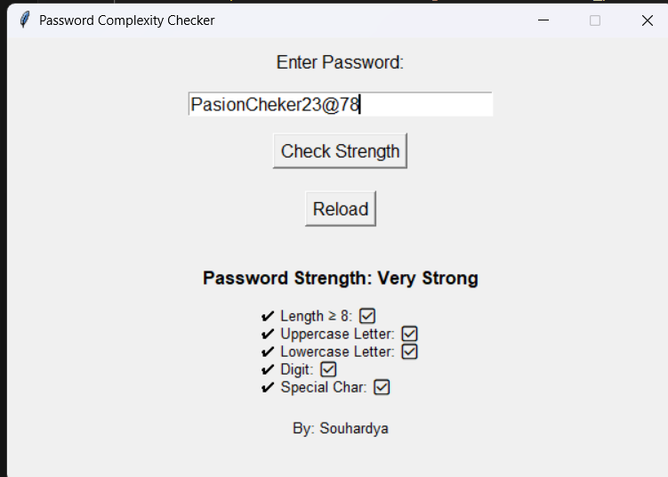

# 🔐 Password Complexity Checker (Tkinter GUI)

**Password Complexity Checker** is a Python GUI application built using Tkinter. It evaluates the strength of a user's password based on key criteria such as length, uppercase and lowercase characters, numbers, and special characters. This tool encourages users to create strong, secure passwords to protect their accounts and data.

---
## 📸 GUI Preview




---

## 🚀 Features

- ✅ Password input field
- ✅ Strength evaluation based on:
  - Length (≥ 8 characters)
  - Uppercase letters
  - Lowercase letters
  - Digits
  - Special characters
- ✅ Visual indicators (✅ / ❌)
- ✅ Password strength rating (e.g., "Very Strong")
- ✅ Reload/reset the form
- ✅ Clean and responsive GUI using Tkinter

---

## 🛠️ Requirements

- Python 3.x

Install dependencies (optional step):
```bash
pip install -r requirements.txt
```

## ▶️ How to Run

1. Ensure you have **Python 3.x** installed.
2. Download or clone the repository.
3. Open a terminal in the project folder and run:

```bash
python main.py
```

---

### ✅ 2. **Author** 


Made with ❤️ by **Souhardya**

If you use or modify this project, feel free to mention the author or contribute!


## 📄 License

This project is licensed under the **MIT License**.

You are free to use, modify, and distribute this project for personal and commercial purposes. See the [LICENSE](LICENSE) file for full details.
